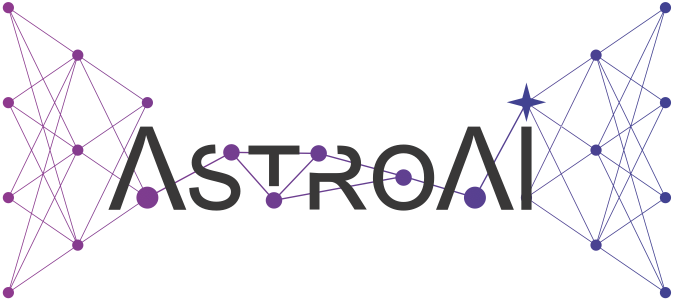
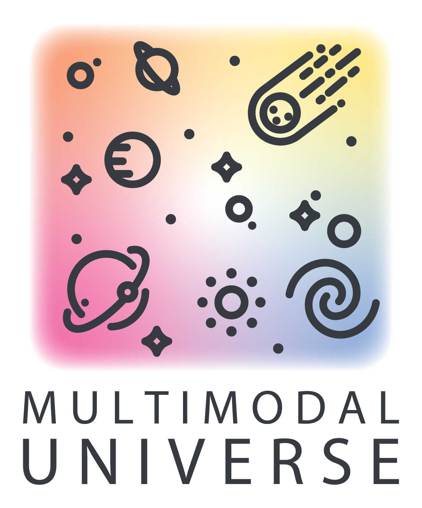
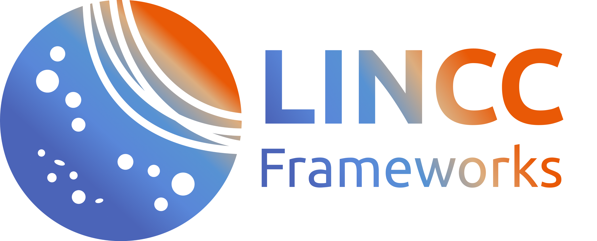
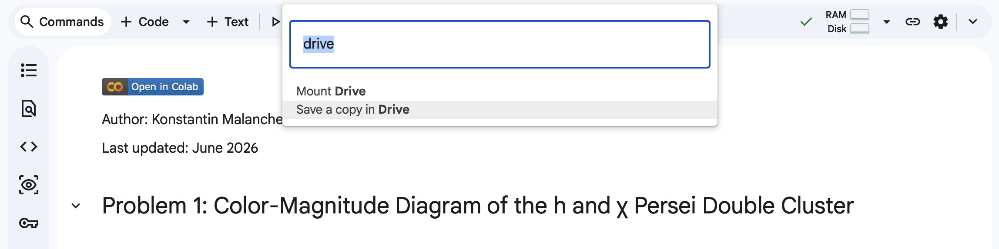

# *WORK IN PROGRESS, please check back later for updates!*

# HATS/LSDB at Astro-AI Workshop, June 17, 2026

  

Demos prepared for the AstroAI workshop, held June 15-18 2026, Cambridge, MA.

The notebooks showcase working with HATS-partitioned survey catalogs via [LSDB](https://lsdb.io), and time domain analysis with [nested-pandas](https://nested-pandas.readthedocs.io/en/latest/).

### When and where:

More information at this [link](https://astroai.cfa.harvard.edu/workshop2026/details.html).

### How to ask for help

* Konstantin (Kostya) Malanchev: <malanchev@cmu.edu>
* GitHub issues for LSDB: https://github.com/astronomy-commons/lsdb/issues
* LSST Discovery Alliance Slack channel
  * Feel free to use [`#lincc-frameworks-lsdb`](https://discovery-alliance.slack.com/archives/C04610PQW9F) channel on LSST-DA slack for any questions, bugs, or problems!
  * For Rubin specific questions, please also check the community forum at https://community.lsst.org/ and the [Rubin Observatory DP1 documentation page for LSDB](https://dp1.lsst.io/products/lsdb.html).
* "Contact us" documentation page for LSDB: https://docs.lsdb.io/en/latest/contact.html

### Main references

* [Slide deck](https://docs.google.com/presentation/d/1NvYeLEGxNCxmBflU8HL4r544yOhmtm9RVkn9OR1ztNg)
* LSDB ([Main page](https://lsdb.io))([LSDB catalogs](https://data.lsdb.io))([on GitHub](https://github.com/astronomy-commons/lsdb))([on ReadTheDocs](https://lsdb.readthedocs.io/en/latest/))  
  * [Rubin Observatory DP1 documentation page for LSDB](https://dp1.lsst.io/products/lsdb.html)  
  * [Working with Rubin data section in LSDB documentation](https://docs.lsdb.io/en/latest/tutorial_toc/toc_rubin.html)
* HATS ([on GitHub](https://github.com/astronomy-commons/hats))([on ReadTheDocs](https://hats.readthedocs.io/en/stable/))
* nested-pandas ([on GitHub](https://github.com/lincc-frameworks/nested-pandas))([on ReadTheDocs](https://nested-pandas.readthedocs.io/en/stable/))

## Getting Started 

You absolutely can run these notebooks on your local machine, but we recommend to use a remote environment, such as Google Colab, a science platform like Rubin Science Platform, or an HPC cluster, because of the large requirements for the data download, and the possibly limited networking capabilities of the workshop WiFi.

### On Google Colab

You need a Google account to use the Colab. We recommend using no more than two Dask workers in the default Colab environment, because of the limited resources. You can also use Colab Pro for more resources, but that is not required to run the notebooks.

You can run any notebook in Colab by clicking on the "Open in Colab" badge at the top of each notebook. This will open the notebook in Colab, where you can run it as usual. Please remember to uncomment the first code cell to install LSDB.

Before you start, save a personal copy to your Google Drive so your changes are not lost when the session ends. Open the command palette (the **Commands** button in the top-right toolbar, or `Ctrl+Shift+P` / `Cmd+Shift+P`), type **Drive**, and select **Save a copy in Drive**.

### On Rubin Science Platform

Make sure that you have access to the Rubin Science Platform and follow the instructions at [lsdb.io/dp1](https://docs.lsdb.io/en/latest/tutorials/pre_executed/rubin_dp1.html#1.-Accessing-the-data-on-Rubin-Science-Platform-(RSP)).

For a complete guide to setting up an RSP account and getting custom versions of LSDB available in
your notebooks, we've put together a [system guide](/setup/) that you might find useful. 

> [!WARNING]
> Note that you have to use the **LATEST WEEKLY** version of the Rubin Science Pipelines on Rubin Science Platform. 

### On Perlmutter

Make sure that you have access to the Rubin Science Platform and follow the instructions at [lsdb.io/dp1](https://docs.lsdb.io/en/latest/tutorials/pre_executed/rubin_dp1.html#2.-Accessing-the-data-on-NERSC-(Perlmutter)).

## [Notebooks](/tutorials/)

### [Notebook 1](/tutorials/Notebook_1_Intro.ipynb)

In this notebook, we will learn how to:

- Import DASK client
- Load object and source catalogs (lazily)
- Show HATS partitioning with ZTF objects and sources
- Save the results of a science workflow to disk

### [Notebook 2](/tutorials/Notebook_2_Crossmatch.ipynb)

In this notebook, we will learn how to:

- Perform crossmatching with existing `LSDB` catalogs
- Stream the results of LSDB operations instead of computing them all at once

### [Notebook 3](/tutorials/Notebook_3_LightCurves.ipynb)

In this notebook, we will learn:

- What nested pandas is
- How to do basic operations on timeseries
- How to find periodic variables with a Lomb–Scargle periodogram

### [Notebook 4](/tutorials/Notebook_4_MultiModal.ipynb)

In this notebook, we will learn how to:

- Build a multimodal dataset by cross-matching Gaia light curves with APOGEE spectra
- Split a catalog into train/validation/test sets and stream training batches
- Export the result to disk in different ML-ready formats: HATS, Lance, and PyTorch tensors

Bring your own model and train a model!

## Acknowledgements

This project is supported by Schmidt Sciences.

This project is based upon work supported by the National Science Foundation under Grant No. AST-2003196.

This project acknowledges support from the DIRAC Institute in the Department of Astronomy at the University of Washington. The DIRAC Institute is supported through generous gifts from the Charles and Lisa Simonyi Fund for Arts and Sciences, and the Washington Research Foundation.
