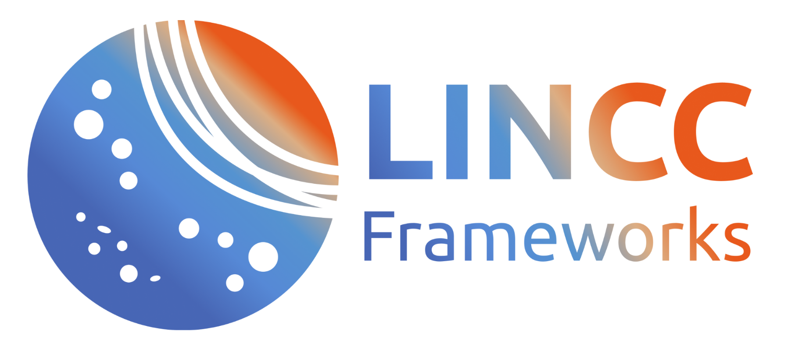

# HATS/LSDB at LSST-DA Regional Meeting; Science with LSST 2026

 

Demos prepared for the LSST Discovery Alliance Regional Meeting: Science with LSST: From Transients to Cosmology, held May 11-15 2026, Baltimore, MD.

The noteboooks showcase working with HATS-partitioned survey catalogs via [LSDB](https://lsdb.io), and time domain analysis with [nested-pandas](https://nested-pandas.readthedocs.io/en/latest/).

### When and where:

More information at this [link](https://docs.google.com/document/d/1SZEhDlJmT0jF9SddhyUpqDnb2GUUJrGUlDZQ1Z9aAZ4/).

### How to ask for help

* Slack channel
  * Feel free to use [`#lincc-frameworks-lsdb`](https://discovery-alliance.slack.com/archives/C04610PQW9F) channel on LSST-DA slack for any questions, bugs, or problems!

### Main references

* [Slide deck](https://docs.google.com/presentation/d/1NvYeLEGxNCxmBflU8HL4r544yOhmtm9RVkn9OR1ztNg)
* LSDB ([Main page](https://lsdb.io))([LSDB catalogs](https://data.lsdb.io))([on GitHub](https://github.com/astronomy-commons/lsdb))([on ReadTheDocs](https://lsdb.readthedocs.io/en/latest/))  
  * [Rubin Observatory DP1 documentation page for LSDB](https://dp1.lsst.io/products/lsdb.html)  
  * [Working with Rubin data section in LSDB documentation](https://docs.lsdb.io/en/latest/tutorial_toc/toc_rubin.html)
* HATS ([on GitHub](https://github.com/astronomy-commons/hats))([on ReadTheDocs](https://hats.readthedocs.io/en/stable/))
* nested-pandas ([on GitHub](https://github.com/lincc-frameworks/nested-pandas))([on ReadTheDocs](https://nested-pandas.readthedocs.io/en/stable/))

## Getting Started 

### On Rubin Science Platform

Make sure that you have access to the Rubin Science Platform and follow the instructions at [lsdb.io/dp1](https://docs.lsdb.io/en/latest/tutorials/pre_executed/rubin_dp1.html#1.-Accessing-the-data-on-Rubin-Science-Platform-(RSP)).

For a complete guide to setting up an RSP account and getting custom versions of LSDB available in
your notebooks, we've put together a [system guide](/setup/) that you might find useful. 

> [!WARNING]
> Note that you have to use the **LATEST WEEKLY** version of the Rubin Science Pipelines on Rubin Science Platform. 

### On Perlmutter

Make sure that you have access to the Rubin Science Platform and follow the instructions at [lsdb.io/dp1](https://docs.lsdb.io/en/latest/tutorials/pre_executed/rubin_dp1.html#2.-Accessing-the-data-on-NERSC-(Perlmutter)).

## [Notebooks](/tutorials/)

### [Notebook 1](/tutorials/Notebook_1_Intro.ipynb)

In this notebook, we will learn how to:

- Import DASK client
- Load object and source catalogs (lazily)
- Show HATS partitioning with ZTF objects and source
- Perform crossmatching with existing `LSDB` catalogs
- Save the results of a science workflow to disk

### [Notebook 2](/tutorials/Notebook_2_Intro.ipynb)

In this notebook, we will learn:

- How to access photo-z catalog derived from Rubin’s Data Preview 1 with LSDB 

### [Notebook 3](/tutorials/Notebook_3_Intro.ipynb)

In this notebook, we will learn:

- What nested pandas is
- How to do basic operations on timeseries

### [Notebook 4](/tutorials/Notebook_4_Intro.ipynb)

In this notebook, we will learn how to:

- Crossmatch custom list of positions
- Access Object and diaObject data from Rubin DP1
- Show lightcurves for both Objects and diaObjects

### [Notebook 5](/tutorials/Notebook_5_Intro.ipynb)

In this notebook, we provide several AGN-related problems:

- Crossmatch SDSS AGNs with Rubin DP1 photo-z catalog
- Crossmatch a large catalog of AGN with Rubin DP1 data
- Run scientific analysis on lightcurves from Rubin DP1

### [Bonus AGN notebook](/tutorials/Notebook_bonus_AGN_Variability_Population_Demo_LSDB.ipynb)

- LSDB version of the TAP version of AGN in DP1 notebook
- Presented by Gordon Richards at the meeting
- This notebook is avaliable at [this link](https://github.com/lsst/data-academy/tree/main/2025)

## Acknowledgements

This project is supported by Schmidt Sciences.

This project is based upon work supported by the National Science Foundation under Grant No. AST-2003196.

This project acknowledges support from the DIRAC Institute in the Department of Astronomy at the University of Washington. The DIRAC Institute is supported through generous gifts from the Charles and Lisa Simonyi Fund for Arts and Sciences, and the Washington Research Foundation.
